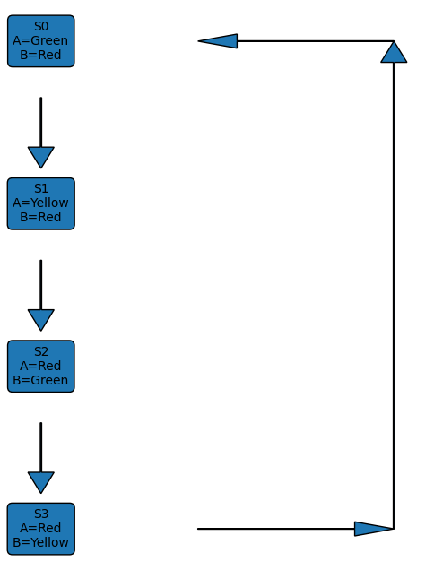
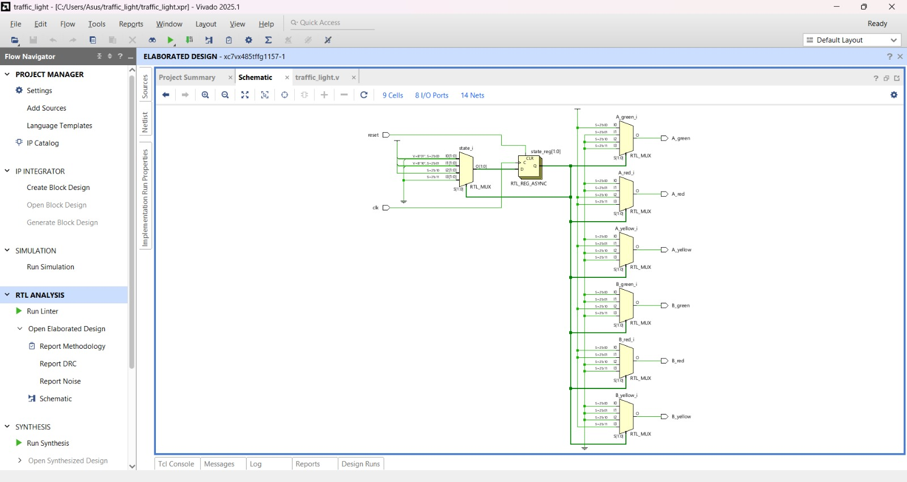
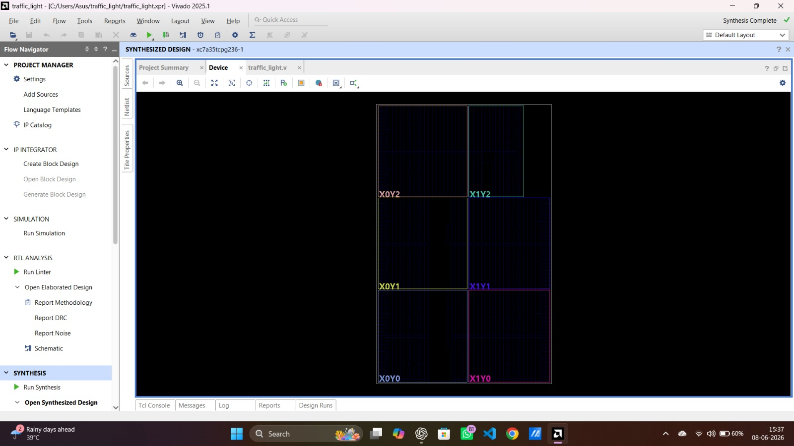

# Traffic Light Controller using Verilog HDL

## Project Overview

This project implements a Traffic Light Controller using Verilog HDL. The controller is designed using a Moore Finite State Machine (FSM) to control traffic signals at a two-road intersection.

The design was developed and synthesized using Xilinx Vivado.

---

## Tools Used

- Verilog HDL
- Vivado Design Suite
- Artix-7 FPGA

---

## Traffic Signal States

| State | Road A | Road B |
|---------|---------|---------|
| S0 | Green | Red |
| S1 | Yellow | Red |
| S2 | Red | Green |
| S3 | Red | Yellow |

State Transition:

S0 → S1 → S2 → S3 → S0

---

## FSM State Diagram



---

## RTL Schematic



---

## Synthesized Design



---

## Project Files

```text
traffic_light.v
state_diagram.png
rtl_schematic.png
synthesized_design.png
README.md
```

---

## Design Flow

1. FSM Design
2. Verilog Coding
3. RTL Elaboration
4. Synthesis
5. Resource Analysis

---

## Concepts Demonstrated

- Finite State Machine (FSM)
- Moore Machine
- Sequential Logic Design
- Verilog HDL
- FPGA Design Flow
- RTL Design
- Digital System Design

---

## Author

Sahil Abbas

B.Tech Electronics and Communication Engineering (ECE)

Interested in VLSI Design, FPGA Design, Embedded Systems, and Telecommunications.
